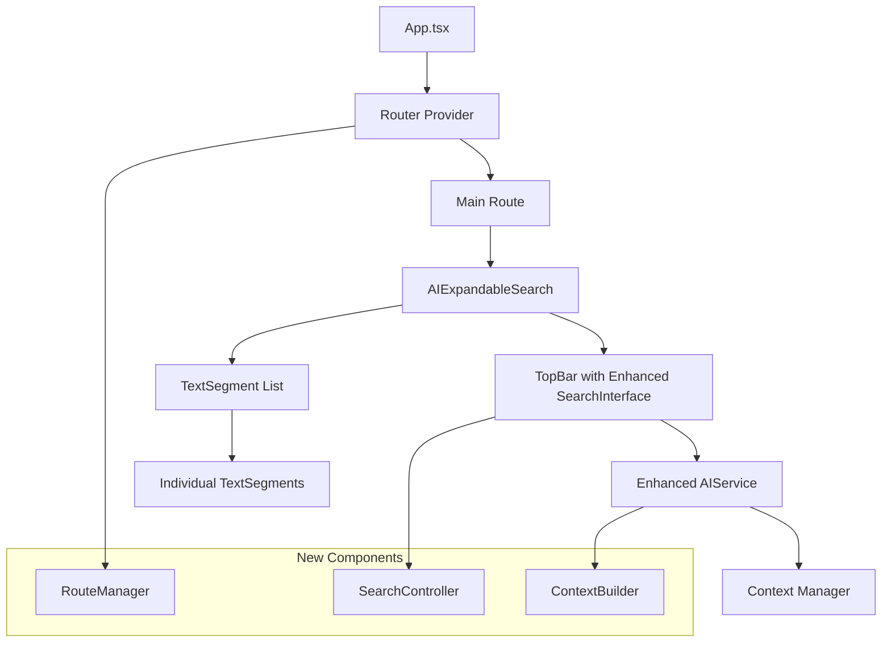

# Design Document

## Overview

This design outlines the optimization of the Finger Reader PWA application for enhanced mobile experience. The solution integrates React Router for navigation management, enhances the AI service with contextual awareness, and improves the search interface for better mobile usability. The design maintains the existing component architecture while adding new capabilities for routing, context management, and improved user interactions.

## Architecture

### Current Architecture Analysis
The application currently uses a single-page architecture with:
- `AIExpandableSearch` as the main orchestrator component
- `TopBar` with integrated `SearchInterface` for user input
- `TextSegment` components for displaying expandable content
- `AIService` for handling API communications
- State management through React hooks with `SearchState` interface

### Enhanced Architecture
The optimized architecture will add:
- **React Router** for navigation and history management
- **Enhanced AI Context System** for maintaining hierarchical context
- **Improved Search State Management** with cancellation support
- **Mobile-Optimized Components** with better touch interactions



## Components and Interfaces

### 1. Router Integration

#### New Router Configuration
```typescript
interface AppRoute {
  path: string;
  element: React.ComponentType;
  title?: string;
}

interface NavigationState {
  searchQuery?: string;
  segmentPath?: string[];
  level?: number;
}
```

#### Route Structure
- `/` - Home/Search page
- `/search/:query` - Search results with query parameter
- `/search/:query/segment/:path` - Deep-linked segment expansion

### 2. Enhanced AI Service Context Management

#### Context Builder Interface
```typescript
interface SegmentContext {
  level: number;
  parentSegments: TextSegment[];
  fullPath: string[];
  originalQuery: string;
}

interface ContextualPrompt {
  basePrompt: string;
  contextualInformation: string;
  hierarchyPath: string;
}
```

#### Context Management Strategy
- **Level 0 (Initial Search)**: Use original query only
- **Level 1**: Include original query + selected segment title
- **Level 2+**: Include original query + full hierarchical path with titles and key content
- **Context Truncation**: Implement intelligent truncation when context exceeds token limits

### 3. Enhanced Search Interface

#### Search Controller Interface
```typescript
interface SearchController {
  currentRequest: AbortController | null;
  isSearching: boolean;
  searchHistory: string[];
  cancelSearch: () => void;
  executeSearch: (query: string) => Promise<void>;
}

interface SearchUIState {
  isVisible: boolean;
  isMinimized: boolean;
  showStopButton: boolean;
  searchValue: string;
}
```

#### Search Behavior States
- **Idle**: Search bar visible, no active request
- **Searching**: Search bar visible, stop button shown, loading indicator active
- **Results**: Search bar minimized (current behavior maintained)
- **Cancelled**: Search bar visible, error cleared, ready for new search

### 4. Mobile-Optimized Components

#### Touch Target Specifications
- Minimum touch target: 44px × 44px (iOS/Android guidelines)
- Segment cards: Minimum 48px height with adequate padding
- Search button: 44px × 44px minimum
- Back button: 44px × 44px minimum

#### Responsive Breakpoints
- Mobile: < 768px
- Tablet: 768px - 1024px
- Desktop: > 1024px

## Data Models

### Enhanced TextSegment
```typescript
interface EnhancedTextSegment extends TextSegment {
  // Existing properties remain the same
  contextPath?: string[]; // Full hierarchical path for context
  routePath?: string; // URL-safe path for routing
}
```

### Navigation State
```typescript
interface NavigationState {
  currentRoute: string;
  searchQuery: string;
  segmentPath: string[];
  navigationHistory: NavigationItem[];
  canGoBack: boolean;
}
```

### Search State Enhancement
```typescript
interface EnhancedSearchState extends SearchState {
  searchController: AbortController | null;
  searchUIState: SearchUIState;
  routeState: NavigationState;
}
```

## Error Handling

### Network Error Management
- **Search Cancellation**: Graceful handling of aborted requests
- **Context Overflow**: Intelligent truncation with user notification
- **Route Navigation Errors**: Fallback to home route with error message
- **AI Service Failures**: Retry mechanism with exponential backoff

### User Experience Error Handling
- **Invalid Routes**: Redirect to home with preserved search query if possible
- **Search Failures**: Clear error state and allow immediate retry
- **Expansion Failures**: Show error on specific segment without affecting others
- **Context Building Errors**: Fallback to simpler context with notification

### Mobile-Specific Error Handling
- **Network Connectivity**: Offline detection and user notification
- **Touch Interaction Failures**: Visual feedback for failed interactions
- **Orientation Changes**: State preservation during orientation changes

## Validation Strategy

### Manual Testing Focus
- **Core Navigation**: Verify router navigation and browser history work correctly
- **Search Functionality**: Test search cancellation and improved UI states
- **Context Enhancement**: Validate that deeper expansions include relevant context
- **Mobile Experience**: Check touch targets and responsive behavior on mobile devices

## Implementation Phases

### Phase 1: Router Integration
- Install and configure React Router
- Create route structure and navigation components
- Implement URL-based state management
- Add deep linking support

### Phase 2: AI Service Enhancement
- Implement context builder for hierarchical context
- Enhance expansion prompts with full context
- Add intelligent context truncation
- Test context relevance improvements

### Phase 3: Search Interface Optimization
- Add search cancellation functionality
- Implement improved search UI states
- Add mobile-optimized touch interactions
- Enhance search feedback and error handling

### Phase 4: Mobile PWA Enhancements
- Optimize touch targets and responsive design
- Enhance PWA navigation in standalone mode
- Add mobile-specific performance optimizations

## Performance Considerations

### Context Management Performance
- **Context Caching**: Cache built contexts to avoid rebuilding
- **Lazy Context Building**: Build context only when needed for expansion
- **Context Compression**: Compress context for API requests when possible

### Mobile Performance
- **Touch Response**: Ensure < 100ms response to touch interactions
- **Smooth Scrolling**: Optimize scroll performance for segment lists
- **Memory Management**: Efficient cleanup of cancelled requests and unused contexts
- **Bundle Optimization**: Code splitting for router and enhanced features

### PWA Performance
- **Service Worker Optimization**: Cache routing and context data
- **Offline Capability**: Basic offline functionality for cached content
- **Fast Loading**: Optimize initial load time for mobile networks